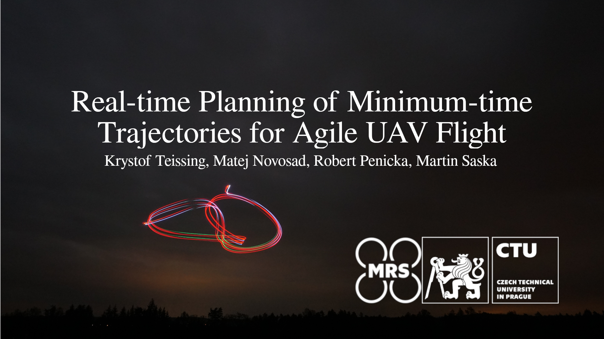

# Real-time Planning of Minimum-time Trajectories for Agile UAV Flight
This repository contains the code for **Real-time Planning of Minimum-time Trajectories for Agile UAV Flight** presented in our [paper](https://ieeexplore.ieee.org/document/10700666).
[](https://youtu.be/wArd536Amro)

## Citing
If you use this code in an academic context, please cite the following publication:

K. Teissing, M. Novosad, R. Penicka and M. Saska, "Real-Time Planning of Minimum-Time Trajectories for Agile UAV Flight," in IEEE Robotics and Automation Letters, vol. 9, no. 11, pp. 10351-10358, Nov. 2024, doi: 10.1109/LRA.2024.3471388. ([PDF](https://arxiv.org/pdf/2409.16074))

```
@ARTICLE{teissing2024pmm,
  author={Teissing, Krystof and Novosad, Matej and Penicka, Robert and Saska, Martin},
  journal={IEEE Robotics and Automation Letters}, 
  title={Real-time Planning of Minimum-time Trajectories for Agile UAV Flight}, 
  year={2024},
  volume={9},
  number={11},
  pages={10351-10358},
  doi={10.1109/LRA.2024.3471388}
}
```

## License
GPL-3.0 License. Copyright (C) 2024 K. Teissing, M. Novosad, R. Pěnička, M. Saska (Faculty of Electrical Engineering, Czech Technical University in Prague).

This is a research code, expect that it changes often and any fitness for a particular purpose is disclaimed.

## Installation
The code has been developed and tested on Ubuntu 20.04.

### Downloading the code
#### Clone the repository

```
git clone git@github.com:ctu-mrs/pmm_uav_planner.git
cd pmm_uav_planner/
```

#### Compile the code

```
make
```

#### Alternatively, you can use CMake to compile the code.

```
mkdir build && cd build
cmake ..
make
```

## Usage Demonstration

<!-- `main.cpp` contains a demonstration on how to use our planner. 
In the demo, we load paramaters of our planner from a planner_config yaml file, and the waypoints through which the trajectory is planned from waypoints_config yaml file.
We have prepared a sample planner config file with recommended parameters in `config/planner`.
For reference of what each parameter present in `planner_config.yaml`, have a look at our paper!
The paths we presented in our paper are located in `config/waypoints`.
The call structure is `./main path/to/planner_config_file path/to/waypoints_config_file`. -->
`main.cpp` contains a demonstration on how to use our planner. 
In the demo, the paramaters of our planner are loaded from the `planner_config.yaml` file and the waypoints, through which the trajectory is planned, are loaded from the `waypoints_config.yaml` file.
A sample planner config file with recommended parameters can be found in `config/planner`.
For more information about parameters in `planner_config.yaml` have a look at our paper!
The paths presented in our paper are located in `config/waypoints`.
The call structure is `./main path/to/planner_config_file path/to/waypoints_config_file`.

For example, to generate a trajectory for the race map, simply run:

```
./main config/planner/planner_config.yaml config/waypoints/race.yaml
```

### Trajectory Visualization

A python script is used to visualize the optimized trajectory.
We recommend creating a virtual environment and activating it using:
```
python3 -m venv env
source env/bin/activate
```

Afterwards install the python dependencies using pip (or pip3 if python3 is not default):
```
pip install numpy matplotlib
```

We have prepared two scripts for visualization of resulting trajectory. Note that parameter `export::sampled_trajectory` has to be set to `true` in `planner_config.yaml`, for visualization to work.
The sampled trajectory will then be saved in `trajectory_data/` as a csv file (without header) in the format

```
t, p_x, p_y, p_z, v_x, v_y, v_z, a_x, a_y, a_z
```
where t [s] contains timestamps, (p_x, p_y, p_z) [m] is the position vector, (v_x, v_y, v_z) [m/s] is the velocity vector, and (a_x, a_y, a_z) [m/s^2] is the acceleration vector.

To visualize a 3D view of the trajectory run:
```
python3 scripts/plot_trajectory.py scripts/trajectory_data/sampled_trajectory.csv
```

To visualize position, velocity and acceleration profiles of the trajectory run:
```
python3 scripts/plot_profiles.py scripts/trajectory_data/sampled_trajectory.csv
```

You can replace `sampled_trajectory.csv` with the file containing sampled trajectory you want to visualize.
